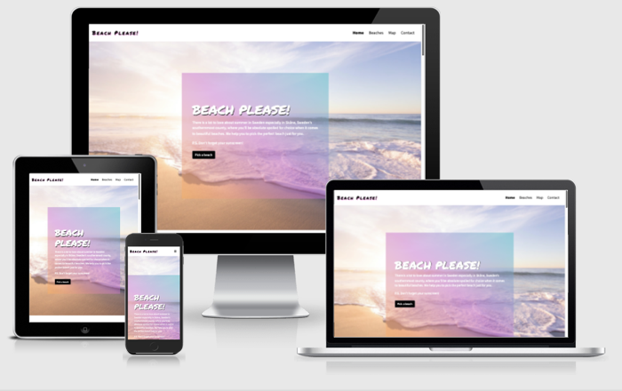
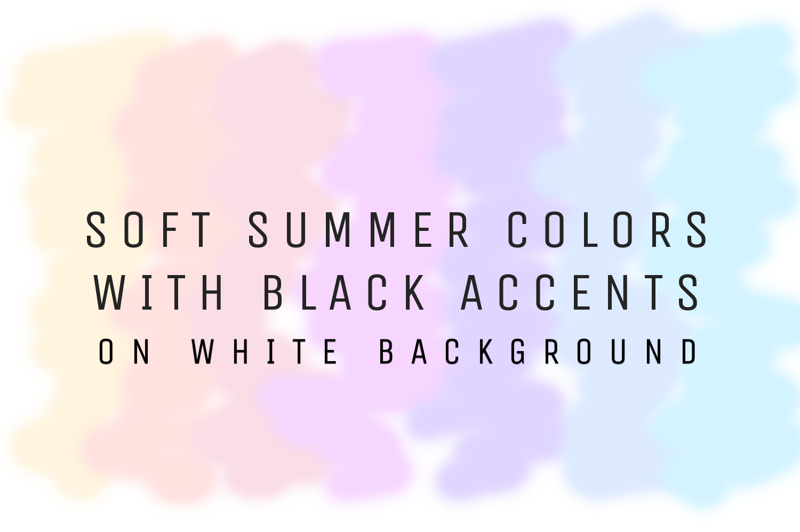

# Beach Please!

[View live website here!](https://jennymalmoe.github.io/BeachPlease/)

[View GitHub repository here!](https://github.com/jennymalmoe/BeachPlease)

 

## Table of contents

___

* UX 
* Strategy
* User Stories
    * Project Goals
    * Business Goals
    * User Goals
* Scope
    * User Requirements and Expectations
* Structure
* Skeleton
* Surface
    * Design Choices
        * Color scheme
        * Typography
        * Imagery
        * Icons
* Technologies used
    * Languages
    * Frameworks
* Features
    * Existing features
    * Features left to implemented 
* Testing
* Issues and Bugs
* Deployment 
* Credits

# UX

### User stories

As a first time visitor I want to:  

* get inspired by the site, the beaches, the design, the beauty of Skåne. Get a positive feel. 
* get information about the beaches in Skåne so I can make a decision whether or not it is interesting information for me. Does the page offers what I want and need? 
* be able to easily navigate and find general information about the beaches, location, information about public transport to get to a beach etc.
* get a wow impression of Skåne (the beaches in Skåne). Does it seem like an inspiring place to me? Does it make me consider visit one of the beaches? Is the site and its content valuble enough for me, as a user, to stay and explore the site and the beaches, and possibly even return?
* be able to see beaches located on a map.
* find out how beaches in Skåne stands out from other beaches (the pages USP's *get inspired and visit one of Skånes beaches*), why should I visit Skåne (Skånes beaches) instead of someone else? 

As a returning visitor (User who don´t know about Skåne, users who lives nearby (in Skåne or in Sweden), potential visitors who had heard about Skåne, I want to:

* get information about some of the popular beaches in Skåne.
* be able to easily navigate and find general information about the beaches etc.
* interact with the site to achieve their personal goals and get answers to questions regarding the beaches.
* be able to see the beaches locations on a map.
* find out how these beaches siuts my needs, does it have parking near by, is it childfriendly, are there restrooms nearby etc?

## Strategy

### Project Goals

The purpose of this project is to *"Create a site that calls on the Google Maps API and/or the Google Places API (or similar) to allow users to search for their next holiday destination."*
(*Code Institute Assessment Handbook*)

### Business Goals/Site owners goals

The business goal of the website is to choose a destination for the next trip to the beach or to attract visitors to Skåne by showing off the beautiful beaches of Skåne.
The website will focus on following taget groups: Users - those who are familiar with Skåne and the beaches of Skåne, those who never heard about Skåne and the beaches of Skåne, those who looks for a holiday destination, those who has an interest and wants to contribute to add more beaches to the site a user that regulary checks in to see if there are any updates (new beaches). Target groups are in other words: those who intentially looks for a holiday destination, those who are curious of Skåne in general and those who hasn't thought of visit Skåne at all previosly but gets inspired by the site to do that.  

### User Goals

Users goals of the website is to get inspired to visit the beaches of Skåne and information about the beaches of Skåne and get highly inspired to go there. Users will be able to see an inspiring, positive, easygoing-feel website with a mobile-first approach that wakes up the users curiosity about Skåne and their beaches as a potential holiday destination. The site signals inspiration, due to the beautiful images and soft colors is not to take to seriously, but user will be able to get good information about the locations, links to related activities like bike rentals, hotels etc. 

## Scope 

### User Requirements and Expectation

* The site is designed to signal easygoing, summer, fun times, inspiration, wanderlust.  

* To be able to select a beach and see a map with the loacation and relevant information.

* Display information about the different beaches and about Skåne.  

* Be able to reach out to site owner/Beach Please and add my own suggestions!

* Be presented to sites social media through links.

## Structure

The website is designed to be consistent and intuitive, but at the same time funny and easygoing. The most importent content is presented in the home page (call to action as well to get linked directly to the beaches page). The brand name is placed top-left corner, since users tend to read/look top-left corner moves down and right from there. 
 
The site consists of four pages. A header that includes brand name and a navigation bar and a footer with social media and weather links will be consistent troughout all pages. 

The site focuses on inviting and inspirering images of the beaches to attract visitors to the beaches (and Skåne). That's the fist thing the users sees when entering the site. Then the goal is to visit the navlinks in the order they are set. Next step should be "Beaches" where the visitor hopefully gets really inspired. Next step presents the map, that makes the vistor even more informed about where Skåne is and where the most beautiful beaches in Skåne are located. And lastly some contactinformation and the opportunity to contact the siteowner and add own beaches destinations ideas.

The information is briefly presented, there isn't not too much information, just enough to make the visitor interested. The visitor will not feel overwhelming (so the user doesn't get overwhelmed leave the site and look for another site).

The site has throughout a lot of space between headings, paragraphs, images, buttons etc to signal lightwight, not to sirous, clear, not to much facts. Insted the sites signals warmth, friendly, soft, youth, inspiration. Even the content reflect those signals by short compelling copy on text and buttons, Also features like back-to-top button has smooth scrolling to make user experince pleasant.

All of the design choices are made to make the site a good user experience. 

## Skeleton 

**Wireframes:** 

* [Mobile](https://github.com/jennymalmoe/MSP2/blob/5c7096b95e7d0f52131faebcc375e8f3b0f25a3d/assets/docs/mobile_wireframes.pdf) 
* [Tablet](https://github.com/jennymalmoe/MSP2/blob/5c7096b95e7d0f52131faebcc375e8f3b0f25a3d/assets/docs/tablet_wireframes.pdf)
* [Desktop](https://github.com/jennymalmoe/MSP2/blob/5c7096b95e7d0f52131faebcc375e8f3b0f25a3d/assets/docs/desktop_wireframes.pdf)

## Surface

### Design Choices

**Colorscheme**
The page consists of a white base with pastel colors and black text and elements such as button and icons. The choice of pastel colors was made because the sites beautiful images of the beaches is supposed to be in focus. By avoiding bright colors and have a clean site, the images of the beaches gets the attention by the user. Warm soft colors offer tranquility. I added black as an accent color wich is bold and vivid and are used spairingly to make the text/information to stand out and be as clear as possible. Black is used on call to actions buttons and icons as well, when you hover them, they turn to the pastel soft summer like color palette.  The chosen colour scheme was specifically selected in order to define the tone/vibe of the page.

**Typography**

Source Sans Pro font is the main font used throughout the site with Permanent Marker as the logo and headers font. Source Sans Pro is a sans serif typeface and feels modern, clean, emotionless font and it's intended use is for user interfaces so it renders very well at small sizes. It's subtle and it doesn´t take any attention away from the content. The site has focused to get the visitors attention by powerful headlines. If the headline hooks the visitor, they tend to continue to read the body, if it doesn't they’ll leave. The headlines font is funny and bigger, bolder and inspiring and will hopefully get the visitor emotionally engaged and get a feel for the easygoing funny site. The charismatic combination of the two fonts compliments the artistic aesthetic and entertaining theme set by the colour palette. 

**Imagery**

Most users teds to be visual learners, and by adding images to accompany information increases people’s retention of said information in their memory.
This reflects greatly on consumer behaviour, which impacts directly on online business. Therefore images is one main component in this site, my strategic plan, and my workflow. 
Articles and sites with images tends to get much more views and interests. Whether the sites message is simple or complex, the first thing the site needs to focus on is the images to appeal to the public at first glance. You need to catch their eyes and lure them in, interest them in “coming it” to see what you’re offering. 

**Icons**

Icons used in footer to set the tone for the sites design approach. 

### Technologies Used

### Languages
* HTML5 
* CSS3 
* JavaScript 

### Frameworks
* [Bootstrap "v4.6"](https://getbootstrap.com) - used for responsiveness and templates.  

Tools and editors:

* [Am I Responsive](http://ami.responsivedesign.is/) - used for testing responsiveness of the site and mock up image.
* [Balsamiq](https://balsamiq.com/) - used to create the wireframes.
* [Bildbank Region Skåne](https://bildbank.skane.se/) - Images used were obtained from Bildbank Region Skåne.
* [Chrome DevTools](https://developer.chrome.com/docs/devtools/)  - used Lighthouse to check sites performance and the dev tool to check responsiveness. 
* [DesignEvo](https://www.designevo.com/) - used to create logo image.
* [Develop Paper](https://developpaper.com/css-container-background-10-color-gradient-demo-linear-gradient/) - gradient text and background.
* [EmailJS](https://www.emailjs.com/) - used to send email from JavaScript. 
* [Fly Wheel](https://getflywheel.com/layout/sticky-back-to-top-button-tutorial/) - back to top button code.
* [Freeformatter](https://www.freeformatter.com/) - used formatter (html), validators (html, CSS, JavaScript), code beautifier (CSS, JavaScript).
* [FreeIcons](https://freeicons.io/) - used for icon in tab.
* [Font Awsome](https://fontawesome.com/) - used for icons.
* [Git](https://git-scm.com/) - used for version control. 
* [GitHub](https://github.com/) - hosting and version control.
* [Github Pages](https://pages.github.com/) - hosting service.
* [Gitpod](https://www.gitpod.io/) - used as IDE.
* [Google Fonts](https://fonts.google.com/) - used to import fonts.
* [Google Maps API](https://developers.google.com/maps/documentation/javascript/overview) - Used for the map.
* [Google Maps JavaScript API](https://developers.google.com/maps/documentation/javascript/overview) - used to customize map.
* [Hotels.com](https://sv.hotels.com/re10234338/hotell-i-skane-lan-sverige/?rffrid=sem.hcom.SE.google.003.00.09.DT.s.kwrd=c.509405665433.121229622458.12614762520..aud-887569466082:dsa-977057223095.9062395...Cj0KCQjwlMaGBhD3ARIsAPvWd6jo7v0bVASDjI1yI91ckFr_0HemTt27lEC0977AiRrv3gN6HFP_izQaAjqeEALw_wcB.aw.ds&PSRC=&gclid=Cj0KCQjwlMaGBhD3ARIsAPvWd6jo7v0bVASDjI1yI91ckFr_0HemTt27lEC0977AiRrv3gN6HFP_izQaAjqeEALw_wcB) - link to hotels in Skåne site.
* [JSHint](https://jshint.com/)
* [jQuery](https://jquery.com/) - jQuery was used to simplify the JavaScript code used.
* [Pixelmator](https://www.pixelmator.com/mac/) - used to resize images.
* [Skånetrafiken](https://www.skanetrafiken.se/) - link to public transport site.
* [Travelshop](https://travelshop.se/en/category/Rent-a-bike/) - link to rental bicycles site.
* [Unsplash](https://unsplash.com/) - Images used were obtained from Unsplash.
* [W3C Markup Validator](https://validator.w3.org/) - used to check html validity.
* [W3C CSS Validator](https://validator.w3.org/) - used to check css.

## Features

### Existing features

Home page:
* CTA button at homepage allows user to get directly to the beaches page. 
* User can click links (rent a bike, public transport, hotels) in text content to be redirected to new site in new tab. 
* User can hover beaches images to get a hint of information, suggesting user to "read more" by clicking the image. The images are linked directly to that beach section on beaches page.

Beaches page:
* CTA to get user to map page.
* All beach cards are linked to map page.

Map page:
* User can click beach buttons to see exacly where the beach is located (CTA).
* User get information about facilities etc by markers texts.
* User can get redirected to public transport information site in new tab.
* User can zoom map for better understanding where the beach is located.
* User can drag the "man" and position him on a location to get street view. 
* User can choose between map/satellite view.

Contact page:
* Contact form at contact page allows user to send suggestions to siteowner by filling out the form.
* User can choose to subscribe to newsletter.  
* User get confirmation that suggestion is succesfully sendt. 

General: 
* User can always return to the homepage by clicking the brand name in upper left corner (strategely placed top-left). 
* All logo images are linked to index.html.
* Back-to-top button is consistent throughout the site and lets user retur to top of the page quickly (by using smooth scrolling). 
* Footer is conventionally placed at the bottom of the screen, allowing users to click on the icons and get redirected to related page in new tab outside of the site. 

### Features left to implement

Widen the information and inspiration by adding good diving spots, good surfplaces, snorkeling facilities etc.

Add more beaches.

Include more information at markers pop up to give the user an even more information about the beach.

Add more links to relevant facilities like restaurants, bed and breakfast, camping places, travel agencies etc.

Possibly collaborations with relevant businesses. 

## Testing

[Link to Testing file](testing.md)

 Comment: All of my own code passed through all validators, but some of my borrowed code has some errors, all features works and looks fine though. I chose to stick with the back-to-top button though the errors, since I feel it really completes the look and feel of my page style. I made that choice (also for my js validation that had errors) based on that all features works as expected and it looks as expected.

## Issues and Bugs

The developer ran into several issues during the development of the site. These are the most distinguishing ones, along with either the solution or idea to implement in the future: 

* Hamburger meny (the three bars) was not lined with logo/brand, showed lower than logo. I had to add a media query that targets device max width, change to smaller text-size and removed the margin-left. Then it looked like it was supposed to.

* There were some extra margin on the beaches page (it could be scrolled from side to side). It seemed it had to do with the row margins. I added .row {margin: 0;} and then the scroll ability disappeared. 

* Top imgage at beaches page streches at mobile view - changed the heigh and it worked out fine. On desktop view I wanted to move the img to the right closer to the text, had a big problem doing that. At the end I had to change the divs from col-lg-6 (both had that) to col-lg-8, resp col-lg-4 since even if the img didnt taking all the space, the space will still be rendered for the div even if it didnt make use of alll of the space. 

## Deployment 
This project is deployed using GitHub Pages. This is how I deployed my GitHub Repository via GitHub Pages:

1. In GitHub select "Your Repositories".
2. Select the repository you want to deploy.
3. Click "Settings" in the top horizontal menu.
4. Inside the "Settings" page scroll down and locate the GitHub Pages headline.
5. Click the link; "Check it out here!".
6. Make sure the branch is set to "Master" then click "Save".
7. Just over the save button you will see that your site is ready to be published and a link will be presented: "Your site is published at https://....." 

Forking the GitHub Repository:
You can fork a GitHub Repository to make a copy of the original repository. You can make changes and review this copy without it affects the original repository. 
Find the repository, click the fork button (top right corner, under your account), you now have a copy of the repository in your GitHub account. 

Make a local clone: 
Find the repository, click "Code" button, copy the link shown, in Gitpod, change the directory to the location you would like the cloned directory to be located, type "git clone" and paste the link you earlier copied, press enter. 

## Credits
* My mentor Oluwaseun Owonikoko for helpfull feedback througout the project.
* Code Institute tutor support.
* Fellow students on Slack for a helping hand when I've got stuck.
* Google!

