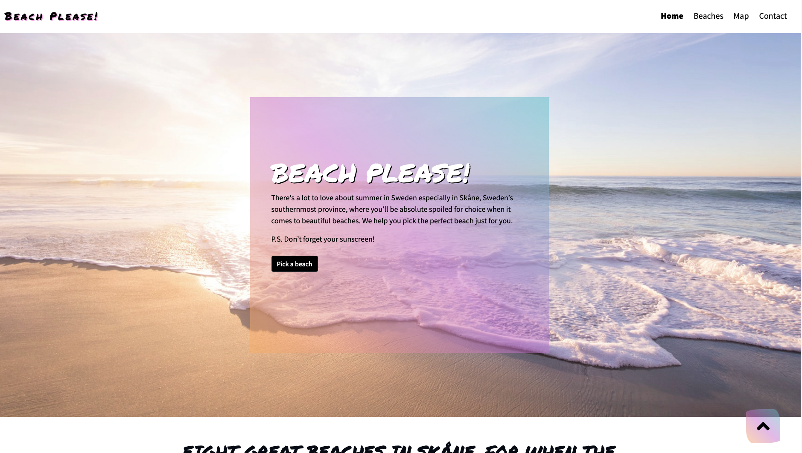

## Contents

___

* Testing user stories 
* Manual testing
* Automated testing
    * Code validation
    * Browser validation
    * Lighthouse
* User testing

 

### Testing user stories

User goals

* As a vistor I want to get a positive feel for the site and get inspired to visit one of the beaches presented.
* As a visitor I want to be able to interact whit page content.
* As a visitor I want to be able to navigate the site easeasily and to be consistent and intuitive.
* As a visitor I want to be presented with (just enough) information about the different beaches and about Skåne.
* As a visitor I want the CTA/buttons to be clearly clickable. 
* As a visitor I want to be able to get to the important information (beaches information) fast and easily. CTA button at homepage allows user to get directly to the beaches page. 
* As a visitor I like to be presented with options to make a visit to a beach possible, links to rent a bike, public transport, hotels in text content should be presented. 
* As a new visitor I don't want to spend to much time reading about the beaches, to be able to just hover beaches images to get a hint of information (what beach it is), suggesting user to "read more" by clicking the image is great. The images are linked directly to that beach section on beaches page.
* As a visitor (and potential visitor to one of the beaches) I would like to be able to see the beaches locations on a map and get some information about them. 
* All beach cards are linked to map page.
* As a visitor I want to be able to get in touch and send in my own suggestions to site owner. By contact form and social media links. 
* As a visitor I want to get information about facilities etc.
* As a visitor I want to be able to see the beaches in street view at Google Maps.
* As a visitor I want to have the option to choose to subscribe to sites newsletter.  
* As a user I want to be confirmed in some way that my contact effort was successfully accomplished. 
* As a visitor I want to be able to get back to home page with few efforts. 
* As a visitor I want footer elements to be relevant. 

### Manual testing 

Manual testing was conducted on all elements that appears throughout the pages. 

* All nav bar links were clicked and verified that they redirected the user to the correct part of the website. Also brand logo.
* By reloading the website I reasured that my heo image were scaled up as supposed. 
* User can easily see where they are since nav bar is active, tested all pages and active sign works as expected.
* When the mouse was hovered over navbar items, buttons, back to top button, icons the colorfull background was presented as expected. 
* By clicking the button "Pick a beach", user was redirected to the beaches page as expected. 
* All links in text content links as they are supposed to.
* The hovering over postcards on home page works as supposed and all are linked correctly to beaches page.
* Back to top button works fina throughout all pages.
* All logos at the bottom of every page is linked to homepage as expected.
* All icons in footer links where user is supposed to be redirected. 
* The "beach map" button on beaches page works fine and links the user to map page as expected.
* Each of the different beach cards buttons were clicked and it was verified that all linked to map page.
* Each of the different map buttons were clicked and it was verified that all linked to map markers as supposed.
* Each of the different map markers were clicked and it was verified that all presented information as supposed.
* Each link in the bottom of marker pop up was verified to link to public transportation site.
* All map features works as they are supposed to, zoom in, out, street view, map/satellite view.
* Contact form works as supposed, user need to fill in both email and message to be able to send contact form, I tried to send without first email, then message. Checkbox works. Modal showing when contact form is send, close button on modal works as expected. 
* I tested all pages and every part of those pages in Chrome Dev tools (desktop, iPad, iPad Pro iPhoneX, iPhone 6/7/8 plus and Am I Responsive and all parts of the site is responsive as expected at all devices. 

### Automated testing

Code validation

Comment: All of my own code passed through all validators, but some of my borrowed code had some errors when ran it through the validators, all features do work and looks fine though (even with the errors in the validators). I chose to stick with the back-to-top button though the errors in the validator, since I feel that my design and that button really completes the look and feel of my page style. So I made that choice (also for som of my js validation that had errors) based on that all features works as expected and looks as expected.

W3C Markup Validator was used to validate the HTML code:
Home page

Beaches page

Map page

Contact

W3C CSS Validator was used to validate the CSS:

CSS

JavaScript
script.js

sendEmail.js

map.js

Browser validation:

Chrome

Safari

Firefox

Edge

Opera

Chrome Dev tool Lighthouse:

Homepage
 
Beaches page

Map page

Contact page

Also got some positive feedback at Slack:s "Peer code review".

### User testing

Friends and family were asked to test and give me feedback of the site and documentation to point out potential bugs and user experience issues. Their helpful advice helped me create a better experience.
These changes were made after input from family and friends:
Changed font color to black for most of the headings and text in jumbotron.
Some text about the beaches that were a little bit to much information.
Complete overhaul of Home Page to avoid dead space and to make the experience more intuitive.
Added more vibrant images of the beaches. 